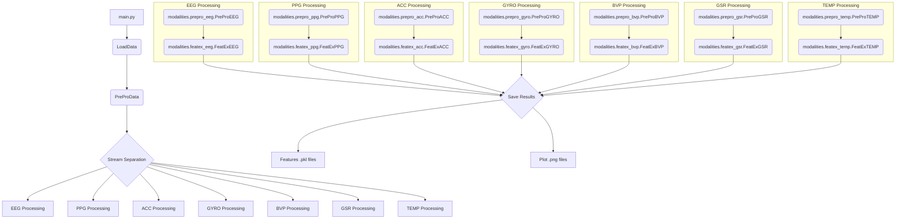

```mermaid
graph TD
    A[main.py] --> B(LoadData);
    B --> C(PreProData);
    C --> D{Stream Separation};
    D --> E[EEG Processing];
    D --> F[PPG Processing];
    D --> G[ACC Processing];
    D --> H[GYRO Processing];
    D --> I[BVP Processing];
    D --> J[GSR Processing];
    D --> K[TEMP Processing];

    subgraph EEG Processing
        E1(modalities.prepro_eeg.PreProEEG) --> E2(modalities.featex_eeg.FeatExEEG);
    end

    subgraph PPG Processing
        F1(modalities.prepro_ppg.PreProPPG) --> F2(modalities.featex_ppg.FeatExPPG);
    end

    subgraph ACC Processing
        G1(modalities.prepro_acc.PreProACC) --> G2(modalities.featex_acc.FeatExACC);
    end

    subgraph GYRO Processing
        H1(modalities.prepro_gyro.PreProGYRO) --> H2(modalities.featex_gyro.FeatExGYRO);
    end

    subgraph BVP Processing
        I1(modalities.prepro_bvp.PreProBVP) --> I2(modalities.featex_bvp.FeatExBVP);
    end

    subgraph GSR Processing
        J1(modalities.prepro_gsr.PreProGSR) --> J2(modalities.featex_gsr.FeatExGSR);
    end

    subgraph TEMP Processing
        K1(modalities.prepro_temp.PreProTEMP) --> K2(modalities.featex_temp.FeatExTEMP);
    end

    E2 --> L{Save Results};
    F2 --> L;
    G2 --> L;
    H2 --> L;
    I2 --> L;
    J2 --> L;
    K2 --> L;

    L --> M[Features .pkl files];
    L --> N[Plot .png files];
```
