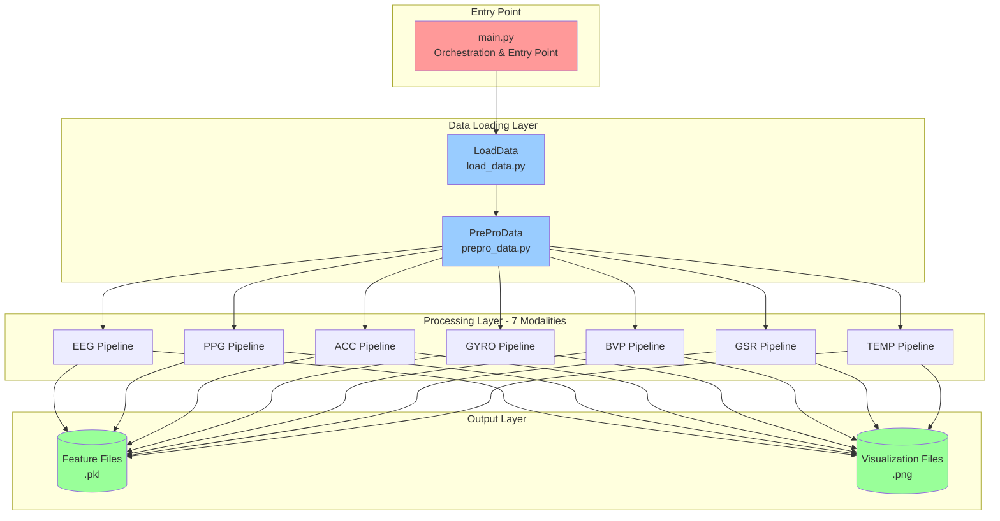
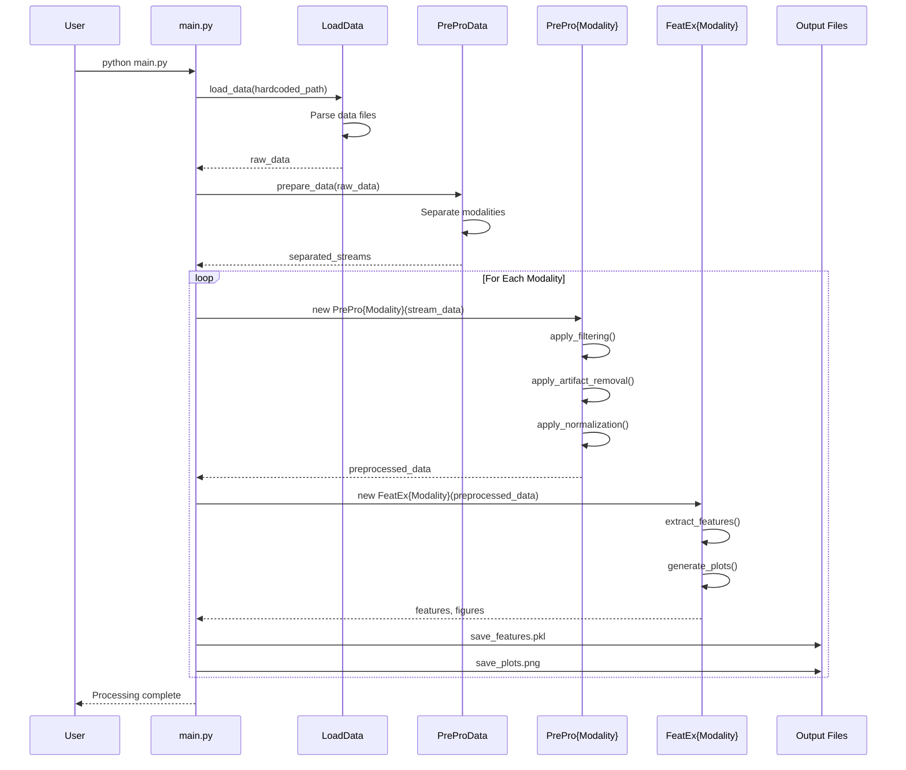

# Architecture Overview - ProSense
**Audit Date:** November 5, 2025
**Auditor:** Claude Code (Senior Technical Auditor AI)

---

## Executive Summary

ProSense is a **monolithic Python research tool** implementing a modular pipeline architecture for multimodal physiological signal processing. The architecture follows a **sequential data flow pattern** where raw sensor data is loaded, preprocessed, feature-extracted, and visualized through modality-specific processing modules.

**Architectural Pattern:** Modular Pipeline (Sequential Processing)
**Implementation Maturity:** 65% - Core pipeline complete, infrastructure missing
**Code Organization:** Class-based object-oriented design with functional orchestration

---

## Technology Stack

### Languages
- **Python 3.11+** (100% of codebase)

### Core Dependencies
| Package | Version | Purpose | Coverage |
|---------|---------|---------|----------|
| pandas | Unknown | Data manipulation | 100% (21/21 files) |
| matplotlib | Unknown | Visualization | 95% (20/21 files) |
| numpy | Unknown | Numerical computing | 90% (19/21 files) |
| scipy | Unknown | Scientific computing | 67% (14/21 files) |
| mne | Unknown | EEG analysis | 24% (5/21 files) |
| seaborn | Unknown | Statistical viz | 14% (3/21 files) |

**⚠️ CRITICAL:** No version pinning - actual versions unknown

### Development Tools
- **IDE:** PyCharm/IntelliJ IDEA (`.idea/` config present)
- **Version Control:** Git
- **Package Manager:** pip (inferred, no requirements.txt)

### Missing Infrastructure
- Build tools (setuptools, poetry, etc.)
- Testing frameworks (pytest, unittest)
- CI/CD pipelines
- Containerization (Docker)
- Code quality tools (linters, formatters, type checkers)

---

## System Architecture

### High-Level Architecture Diagram



### Modality Processing Pipeline (Detail)

Each of the 7 modalities follows identical processing pattern:

```mermaid
graph LR
    RAW[Raw Signal Data] --> PREPRO[PrePro{Modality}<br/>Preprocessing]
    PREPRO --> FEATEX[FeatEx{Modality}<br/>Feature Extraction]
    FEATEX --> FEATURES[Features<br/>DataFrame]
    FEATEX --> PLOTS[Visualizations<br/>Figures]

    FEATURES --> SAVE_PKL[Save .pkl]
    PLOTS --> SAVE_PNG[Save .png]

    style RAW fill:#ffcccc
    style PREPRO fill:#ccccff
    style FEATEX fill:#ccccff
    style FEATURES fill:#ccffcc
    style PLOTS fill:#ccffcc
```

**Preprocessing Steps (varies by modality):**
- Filtering (bandpass, notch, lowpass, highpass)
- Downsampling
- Artifact removal (ICA for EEG)
- Epoching/segmentation
- Normalization/standardization

**Feature Extraction (modality-specific):**
- Time-domain features (mean, std, min, max, RMS)
- Frequency-domain features (PSD, spectral entropy, band powers)
- Statistical features (skewness, kurtosis, percentiles)
- Domain-specific features (HRV for PPG/BVP, band ratios for EEG)

---

## Component Architecture

### Core Components

#### 1. Orchestration Layer (`main.py`)
```
Responsibilities:
  - Application entry point
  - Pipeline orchestration
  - Modality routing
  - Output management (save_figures helper)

Dependencies:
  - All modality modules
  - LoadData, PreProData
  - External libraries (mne, pandas, numpy, matplotlib, scipy)

Functions:
  - save_figures() - Figure saving utility
  - process_eeg() - EEG processing pipeline
  - process_ppg() - PPG processing pipeline
  - process_acc() - ACC processing pipeline
  - process_gyro() - GYRO processing pipeline
  - process_bvp() - BVP processing pipeline
  - process_gsr() - GSR processing pipeline
  - process_temp() - TEMP processing pipeline
  - if __name__ == '__main__': - Main execution block

Issues:
  ❌ Hardcoded data paths (D:/Study Data/...)
  ❌ Massive code duplication (process_* functions nearly identical)
  ❌ No configuration system
  ❌ No command-line interface
```

#### 2. Data Loading Layer

**LoadData** (`load_data.py`)
```
Purpose: Load and parse physiological data files
Methods:
  - File I/O operations
  - Data format parsing
  - Initial data structuring

Dependencies: pandas, mne, numpy, scipy, pickle, matplotlib

Issues:
  ⚠️ Uses pickle (security risk)
  ⚠️ Likely contains hardcoded assumptions about file formats
```

**PreProData** (`prepro_data.py`)
```
Purpose: Initial data preparation and stream separation
Methods:
  - Data validation
  - Stream/modality separation
  - Initial transformations

Dependencies: pandas, numpy, matplotlib, pickle, mne

Issues:
  ⚠️ Uses pickle
  ⚠️ 22.7KB - potentially complex with multiple responsibilities
```

#### 3. Modality Processing Modules (14 files)

**Preprocessing Classes** (7):
- PreProEEG, PreProPPG, PreProACC, PreProGYRO
- PreProBVP, PreProGSR, PreProTEMP

**Feature Extraction Classes** (7):
- FeatExEEG, FeatExPPG, FeatExACC, FeatExGYRO
- FeatExBVP, FeatExGSR, FeatExTEMP

```
Consistent Interface (per modality):
  PrePro{Modality}:
    - __init__(data)
    - apply_*() methods (filtering, normalization, etc.)
    - plot_*() methods (visualization)

  FeatEx{Modality}:
    - __init__(data)
    - extract_*() methods (feature computation)
    - plot_*() methods (visualization)

Design Pattern: Strategy Pattern (interchangeable modality processors)

Issues:
  ⚠️ Tight coupling: Feature extraction classes also handle visualization
  ⚠️ Single Responsibility Principle violation
  ⚠️ Testing difficulty due to mixed concerns
```

#### 4. Utility Components

**log_parser.py** (34.7KB - largest utility)
```
Purpose: Parse and analyze log files
Class: LogParser
Dependencies: pandas, numpy, json, csv, logging, traceback, pickle

Notes:
  - Complex module (34.7KB)
  - Purpose unclear from architecture docs
  - May be auxiliary to main pipeline
  - Uses pickle (security risk)
```

**Correlation Analysis:**
- `correlate_datasets.py` - Dataset correlation
- `correlate_features.py` - Feature correlation
- `load_features.py` - Feature loading utilities

```
Purpose: Post-processing analysis and feature correlation
Dependencies: pandas, numpy, matplotlib, seaborn

Notes:
  - Appear to be separate analytical tools
  - Not part of main processing pipeline
  - May be used for research analysis
```

---

## Data Flow Diagram



---

## Architectural Patterns & Principles

### Design Patterns Observed

1. **Strategy Pattern** ✓
   - Interchangeable modality processors (PrePro*/FeatEx*)
   - Consistent interface across modalities
   - Good encapsulation of modality-specific logic

2. **Template Method Pattern** ✓
   - process_*() functions in main.py follow identical structure
   - **Problem:** Implemented via code duplication instead of inheritance

3. **Factory Pattern** ❌ (Missing)
   - No factory for creating modality-specific processors
   - All instantiation is manual in main.py

### Design Principles Assessment

| Principle | Compliance | Notes |
|-----------|-----------|-------|
| **Single Responsibility** | ❌ Poor | FeatEx classes do both extraction AND visualization |
| **Open/Closed** | ⚠️ Partial | Modality modules are closed, but main.py requires modification to add modalities |
| **Liskov Substitution** | ✓ Good | Modality classes are interchangeable |
| **Interface Segregation** | ✓ Good | Classes expose only necessary methods |
| **Dependency Inversion** | ❌ Poor | main.py depends on concrete classes, not abstractions |
| **DRY (Don't Repeat Yourself)** | ❌ Poor | Massive duplication in process_*() functions |

---

## Architectural Issues & Anti-Patterns

### Critical Issues

1. **Hardcoded Configuration**
   ```python
   # main.py (example of anti-pattern)
   data_path = "D:/Study Data/..."  # ❌ Not portable
   ```
   **Impact:** Application cannot run on any other machine without code modification

2. **No Abstraction Layer**
   - No base classes for PrePro* or FeatEx* classes
   - No common interface enforcement
   - Difficult to ensure consistency across modalities

3. **God Object** (`main.py`)
   - 19KB file with orchestration for all 7 modalities
   - High cyclomatic complexity
   - Knows too much about all components

### Major Issues

4. **Mixed Concerns** (FeatEx classes)
   ```
   FeatExEEG:
     - Feature extraction logic ✓
     - Statistical computations ✓
     - Plotting/visualization ❌ (should be separate)
     - File I/O operations ❌ (should be separate)
   ```

5. **Code Duplication**
   - 7 nearly-identical `process_*()` functions in main.py
   - Plotting code repeated across all FeatEx* classes
   - Should use inheritance or composition

6. **No Dependency Injection**
   - All dependencies created inline
   - Cannot mock for testing
   - Tight coupling

### Minor Issues

7. **Dead Code**
   - Commented-out method calls in main.py:
     - `apply_baseline_correction()` (EEG)
     - `apply_rejection()` (EEG)
   - Unclear if intentionally disabled or incomplete

8. **Lack of Error Handling**
   - No apparent try/catch blocks
   - No validation of file paths
   - No graceful degradation

---

## Comparison: Intended vs. Actual Architecture

### ✓ Matches Intent
- Modular design with 7 modality-specific modules
- Sequential pipeline (Load → PrePro → FeatEx → Save)
- Separation of preprocessing and feature extraction
- Visualization integrated with analysis

### ❌ Deviations from Intent
- **Documentation claims:** "streamlined data analysis process"
  - **Reality:** Requires code editing to change data paths
- **Documentation claims:** "automated and manual visualization"
  - **Reality:** Only automated visualization implemented
- **Documentation claims:** "pip install -r requirements.txt"
  - **Reality:** requirements.txt doesn't exist
- **Documentation claims:** Repository named "StreamSense"
  - **Reality:** Actually named "ProSense"

---

## Deployment Architecture (Current)

```
DEPLOYMENT MODEL: None (Not deployable)

Current "Deployment" Method:
  1. Clone repository
  2. Manually guess and install dependencies
  3. Edit main.py to change hardcoded paths
  4. Run: python main.py
  5. Hope it works

Issues:
  ❌ No environment isolation
  ❌ No configuration management
  ❌ No dependency versioning
  ❌ No build/installation process
  ❌ No containerization
  ❌ No CLI interface
  ❌ No logging/monitoring
```

---

## Recommended Architecture Improvements

### Immediate (Critical)
1. **Configuration System**
   ```python
   # config.yaml
   data:
     input_path: /path/to/data
     output_path: /path/to/output

   processing:
     modalities: [eeg, ppg, acc, gyro, bvp, gsr, temp]
     eeg:
       sampling_rate: 200
       filter_low: 1
       filter_high: 40
   ```

2. **Dependency Management**
   ```
   Create requirements.txt:
   numpy>=1.24.0
   pandas>=2.0.0
   scipy>=1.10.0
   matplotlib>=3.7.0
   seaborn>=0.12.0
   mne>=1.4.0
   ```

3. **Eliminate Code Duplication**
   ```python
   # Proposed refactor
   def process_modality(modality_name, data, files):
       prepro_class = get_preprocessor(modality_name)
       featex_class = get_feature_extractor(modality_name)
       # ... unified processing logic
   ```

### Short-Term (High Priority)
4. **Separate Concerns**
   - Extract visualization to separate module
   - Create Plotter classes independent of FeatEx

5. **Add Base Classes**
   ```python
   from abc import ABC, abstractmethod

   class BasePreProcessor(ABC):
       @abstractmethod
       def preprocess(self, data): pass

   class BaseFeatureExtractor(ABC):
       @abstractmethod
       def extract_features(self, data): pass
   ```

6. **CLI Interface**
   ```bash
   python -m prosense --config config.yaml --modality eeg --input data/ --output results/
   ```

### Long-Term (Medium Priority)
7. **Microservices Architecture** (if scaling needed)
   - API Gateway
   - Modality processing services
   - Result aggregation service

8. **Plugin System**
   - Allow dynamic loading of new modalities
   - No code modification to add new sensors

---

## Architecture Quality Score: 5/10

| Criterion | Score | Notes |
|-----------|-------|-------|
| Modularity | 7/10 | Good modality separation, but poor within modules |
| Maintainability | 3/10 | Code duplication, mixed concerns |
| Scalability | 4/10 | Monolithic, hard to distribute processing |
| Testability | 2/10 | Tight coupling, no dependency injection |
| Portability | 1/10 | Hardcoded paths |
| Extensibility | 6/10 | Easy to add modalities (copy-paste), but not ideal |
| Security | 2/10 | Pickle usage, no input validation |

**Overall:** Functional prototype with good high-level structure but poor implementation quality and missing production infrastructure.

---

**End of Architecture Overview**
